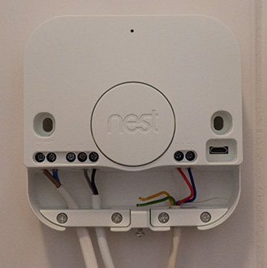
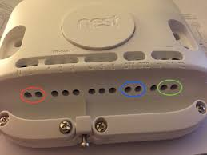
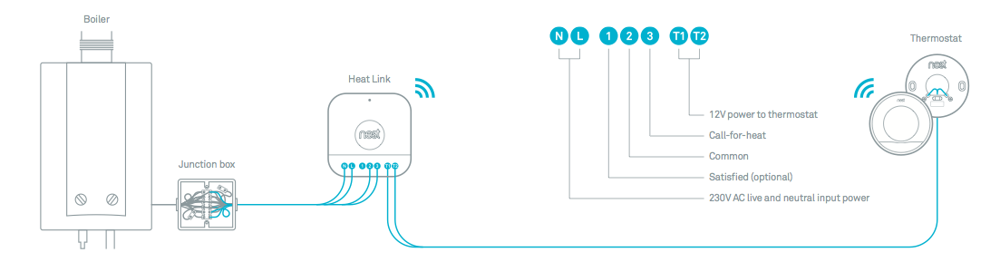
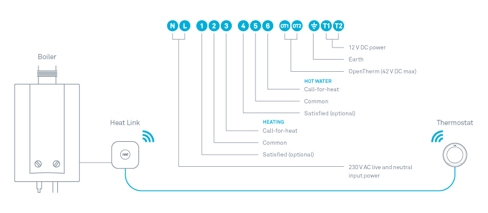
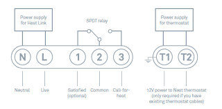
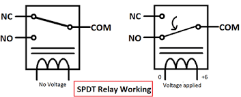
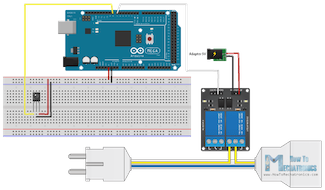
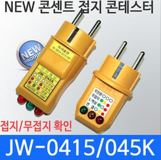

## 네스트 유럽형 히트 링크에 대해
* 본체 연결에 대해서는 설명 못함(히트링크만 해봄..)

지인의 집에 지인과 히트링크를 설치해보면서 이런건 설명 안 해주나 했던것들
1. Live / Neutral (L/N)이 뭐냐
2. 단상 3선식 케이블의 색상과 의미(가정집은 대개 단상 3선식)

먼저 네스트 히트 링크를 보면 2/3 세대로 구분되고, 3세대가 2세대에 비해 릴레이 하나와/OpenTherm(유럽 보일러 접속 규격인듯) 단자가 추가 되었는데,OpenTherm는 모르므로 생략. 3세대는 난방(Heating)과 온수(Hot water) 조절이 되는듯 하지만, 온수에 대한 정보가 부족해서 난방(단자 1/2/3)만 연결.

2세대 | 3세대
  ---|---
 | 

2세대|
  ---|
 |

3세대|
  ---|
 |

네스트 히트링크는 1/2/3, 4/5/6의 동작과 연결을 이해하면,
맨 처음에 적었던 L/N과 케이블 색깔에 대해 고민 하게 됨.

아두이노 좀 봤으면 다 알고 있을 릴레이가 1/2/3, 4/5/6.
보통 릴레이는 단자가 3개인데 NC/NO/COM 임. 저전압 회로로 고전압 회로를 개폐하기 위하여 릴레이가 사용됨.

약어 | 의미 | _ | heat link(heating) 1/2/3 | heat link(hot water) 4/5/6
  ---|---|---|---|---
NC | Normally Closed | 신호 없을때 C가 연결됨 | 1 | 4 
NO | Normally Open   | 신호 있을때 C가 연결됨 | 3 | 6
C  | Common | NC 또는 NO에 연결됨 | 2 | 5

2세대 | spdt relay
  ---|---
 | 

네스트는 난방이 필요한 경우 2번 단자와 3번 단자를 연결만 해주는 것임.
즉 1/2/3, 4/5/6에 온/오프가 필요한 케이블을 연결해야 함.

L/N, 색상에 대한 의문은 아래 참고의 링크에 잘 설명 되어 있으나, 멀티미터를
이용하여 확인하는 것이 최선으로 생각됨.
또는 아래의 테스터를 이용해도(하나 살려구요. 멀티미터로 테스트 하는것도 귀잖....)

* 참고1 https://en.wikipedia.org/wiki/Switch
* 참고2 https://en.wikipedia.org/wiki/Relay
* 참고3 전원선 활성(L), 중성(N) 확인 http://blog.naver.com/pkw00/220333975771
* 참고4 전원색상 http://m.blog.naver.com/k5808151/50105866676
* 

